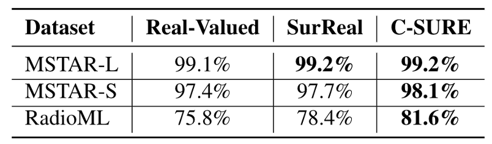
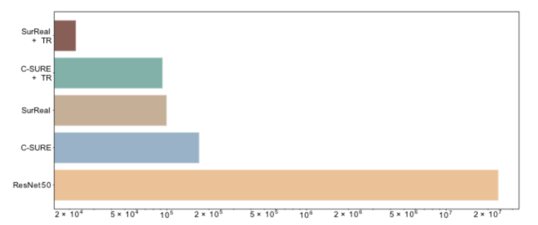
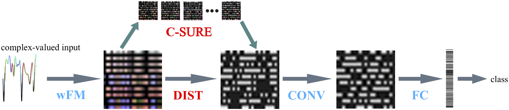
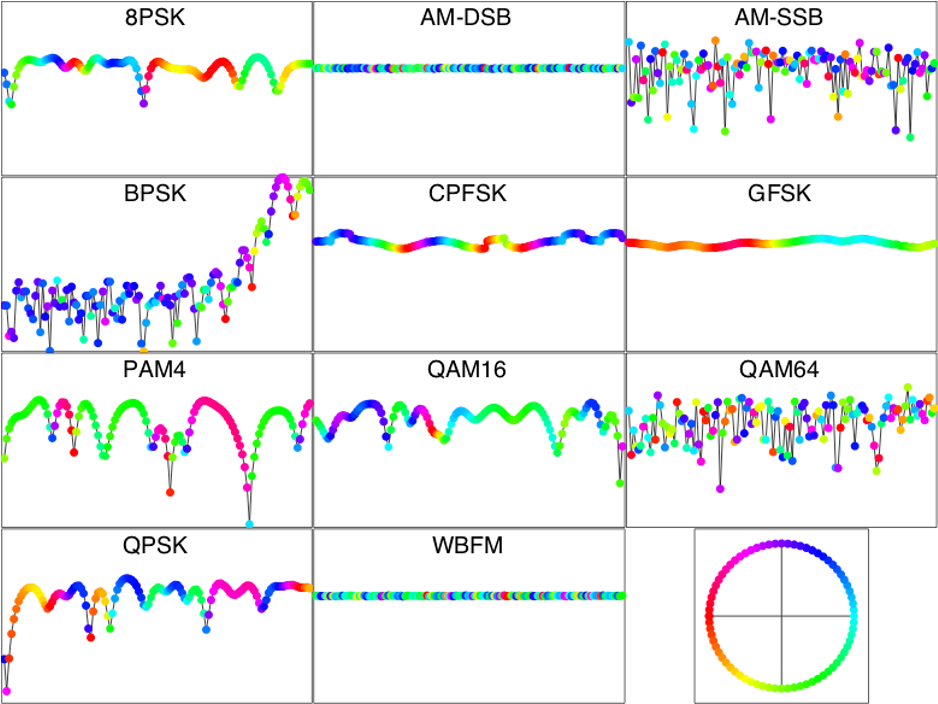

# C-SURE: Shrinkage Estimator and Prototype Classifier for Complex-Valued Deep Learning
- This work is an updated version of [This Paper](https://arxiv.org/abs/1910.11334)
## Abstract

The James-Stein (JS) shrinkage estimator is a biased estimator that captures the mean of Gaussian random vectors. While it has a desirable statistical property of dominanceover the maximum likelihood estimator (MLE) in terms ofmean squared error (MSE), not much progress has beenmade on extending the estimator onto manifold-valued data.

We propose C-SURE, a novel Stein’s unbiased risk esti-mate (SURE) of the JS estimator on the manifold of complex-valued data with a theoretically proven optimum over MLE. Adapting the architecture of the complex-valued SurRealclassifier, we further incorporate C-SURE into a prototype convolutional neural network (CNN) classifier.

We compare C-SURE with SurReal and a real-valued baseline on complex-valued MSTAR and RadioML datasets.C-SURE is more accurate and robust than SurReal, and the shrinkage estimator is always better than MLE for thesame prototype classifier.  Like SurReal, C-SURE is much smaller, outperforming the real-valued baseline on MSTAR(RadioML) with less than1%(3%) of the baseline size.



## People
- [Yifei Xing](mailto:xingyifei2016@berkeley.edu) 
- [Rudrasis Chakraborty](https://github.com/rudra1988)
- [Minxuan Duan](https://www.researchgate.net/profile/Duan_Minxuan)
- [Stella Yu](mailto:stellayu@berkeley.edu)




## Requirements
* [PyTorch](https://pytorch.org/)

## Data 



- First, run `cat data_split* > data_polar.zip` inside the `data` folder.

- Next, extract `data_polar.zip` and set the correct path to the data_polar folder inside the argparse configuration in `train_demo.py`

## Baseline
[Here](https://github.com/xingyifei2016/RotLieNet) is code for the baseline SurReal model that we used in the paper. 


## Getting Started (Training & Testing)


- To train the model: 
```
python train_demo.py
```

## CAUTION
The current code was prepared using single GPU. The use of multi-GPU may cause problems. 

## License and Citation
The use of this software is RESTRICTED to **non-commercial research and educational purposes**.
